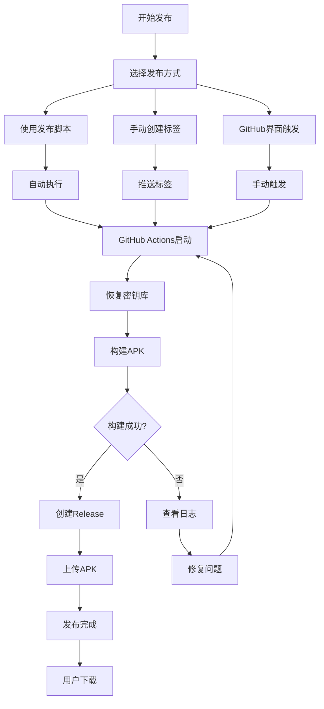

# 📁 GitHub发布文件总览

## 📋 目录结构

```
android-tv-app/
├── .github/workflows/              # GitHub Actions工作流
│   ├── build-and-release.yml       # 自动构建和发布APK
│   ├── restore-keystore.yml        # 密钥库恢复和测试
│   └── auto-tag-release.yml        # 自动创建版本标签
│
├── app/                            # 应用模块
│   ├── keystore.properties         # 密钥库配置文件（本地）
│   ├── build.gradle               # 构建配置（含签名）
│   └── ...
│
├── version.properties              # 版本号配置
├── upload-keystore.jks            # 签名密钥库（本地生成）
│
├── 发布脚本/
│   ├── release.sh                 # Linux/macOS发布脚本
│   └── release.bat                # Windows发布脚本
│
├── 配置/
│   ├── .gitignore                 # Git忽略文件
│   └── keystore.properties        # 密钥库配置模板
│
└── 文档/
    ├── README-GitHub发布.md         # GitHub发布说明
    ├── GitHub自动发布说明.md        # 自动发布指南
    ├── GitHub发布指南.md           # 完整发布手册
    └── GitHub发布文件总览.md        # 本文件
```

---

## 🔧 核心文件说明

### 1️⃣ GitHub Actions工作流

#### build-and-release.yml
**作用**: 自动构建和发布APK到GitHub Releases

**触发条件**:
- 推送版本标签 (如 v1.0.0)
- 手动触发

**主要功能**:
- 设置JDK和Android SDK
- 缓存Gradle依赖
- 构建Release和Debug APK
- 创建GitHub Release
- 上传APK文件到Release

**输出**:
- `app-release.apk` - 已签名发布版
- `app-debug.apk` - 调试版

#### restore-keystore.yml
**作用**: 恢复密钥库文件并测试构建

**触发条件**: 手动触发

**主要功能**:
- 从GitHub Secrets恢复密钥库
- 创建keystore.properties配置
- 验证密钥库有效性
- 测试构建过程

**用途**: 调试密钥库配置问题

#### auto-tag-release.yml
**作用**: 自动创建版本标签

**触发条件**: 推送到main分支且提交信息为"Release version"

**主要功能**:
- 从build.gradle提取版本号
- 自动创建Git标签
- 触发构建流程

**用途**: 简化发布流程

---

### 2️⃣ 配置文件

#### version.properties
**作用**: 统一管理版本号

**格式**:
```properties
VERSION_NAME=1.0.0
VERSION_CODE=1
```

**使用场景**:
- 发布前更新版本号
- 自动递增版本代码
- CI/CD读取版本信息

#### keystore.properties
**作用**: 密钥库配置

**格式**:
```properties
storeFile=../upload-keystore.jks
storePassword=YOUR_STORE_PASSWORD
keyAlias=upload
keyPassword=YOUR_KEY_PASSWORD
```

**注意**:
- 不提交到GitHub
- 仅本地使用
- 生产环境通过Secrets管理

#### .gitignore
**作用**: 指定Git忽略的文件和目录

**关键条目**:
```gitignore
# 密钥库文件
*.jks
*.keystore

# 配置文件
keystore.properties
version.properties

# 构建输出
*.apk
build/
.gradle/
```

---

### 3️⃣ 发布脚本

#### release.sh (Linux/macOS)
**作用**: 自动化发布流程

**功能**:
- 验证版本号格式
- 检查密钥库
- 更新版本号
- 构建测试
- Git提交和推送
- 创建标签

**使用方法**:
```bash
chmod +x release.sh
./release.sh 1.0.0
```

#### release.bat (Windows)
**作用**: Windows版发布脚本

**功能**: 同release.sh

**使用方法**:
```cmd
release.bat 1.0.0
```

---

### 4️⃣ 密钥库文件

#### upload-keystore.jks
**作用**: Android应用签名密钥库

**生成命令**:
```bash
keytool -genkey -v -keystore upload-keystore.jks \
  -keyalg RSA -keysize 2048 -validity 10000 -alias upload
```

**安全要求**:
- 强密码保护
- 安全存储
- 备份到安全位置
- 不上传到GitHub

---

## 📚 文档体系

### 1️⃣ 快速入门

#### README-GitHub发布.md
**目标用户**: 开发者
**内容**: 30秒快速发布指南
**包含**:
- 快速导航
- 30秒发布步骤
- 发布版本类型
- 自动发布流程

### 2️⃣ 详细指南

#### GitHub自动发布说明.md
**目标用户**: 开发者
**内容**: 自动发布系统详细说明
**包含**:
- 环境配置
- GitHub Secrets设置
- 工作流程说明
- 故障排除

#### GitHub发布指南.md
**目标用户**: 开发者/维护者
**内容**: 完整的发布流程手册
**包含**:
- 环境准备
- 配置签名密钥
- GitHub Actions设置
- 手动发布步骤
- 安全配置
- 最佳实践

### 3️⃣ 参考文档

#### GitHub发布文件总览.md
**目标用户**: 所有用户
**内容**: 文件总览和索引
**包含**:
- 文件结构说明
- 每个文件的作用
- 文档关联关系
- 快速索引

---

## 🔄 发布流程图



---

## 🎯 使用场景

### 场景1: 首次设置

**步骤**:
1. 阅读 `GitHub发布指南.md`
2. 生成密钥库
3. 配置GitHub Secrets
4. 测试工作流

**相关文件**:
- `GitHub发布指南.md`
- `keystore.properties`
- `restore-keystore.yml`

### 场景2: 日常发布

**步骤**:
1. 运行发布脚本
2. 监控构建状态
3. 下载APK文件

**相关文件**:
- `release.sh` / `release.bat`
- `build-and-release.yml`
- `version.properties`

### 场景3: 问题排查

**步骤**:
1. 查看构建日志
2. 检查Secrets配置
3. 测试密钥库

**相关文件**:
- `GitHub自动发布说明.md` (故障排除部分)
- `restore-keystore.yml`

---

## 📊 文件统计

### 配置文件

| 类型 | 数量 | 位置 |
|------|------|------|
| GitHub Actions工作流 | 3 | `.github/workflows/` |
| 构建配置 | 2 | `app/build.gradle`, `version.properties` |
| 密钥库配置 | 2 | `upload-keystore.jks`, `keystore.properties` |
| 发布脚本 | 2 | `release.sh`, `release.bat` |
| 忽略文件 | 1 | `.gitignore` |

### 文档文件

| 文档 | 用途 | 长度 |
|------|------|------|
| README-GitHub发布.md | 快速入门 | 中 |
| GitHub自动发布说明.md | 自动发布 | 长 |
| GitHub发布指南.md | 完整手册 | 超长 |
| GitHub发布文件总览.md | 文件索引 | 中 |

---

## 🔍 快速索引

### 需要修改的文件

| 文件 | 修改频率 | 目的 |
|------|----------|------|
| `version.properties` | 每次发布 | 更新版本号 |
| `keystore.properties` | 首次设置 | 配置密钥库 |

### 不需要修改的文件

| 文件 | 作用 |
|------|------|
| `.github/workflows/*.yml` | GitHub Actions配置 |
| `release.sh` / `release.bat` | 发布脚本 |
| `.gitignore` | Git忽略规则 |

### 生成的临时文件

| 文件 | 用途 | 位置 |
|------|------|------|
| `app/build/outputs/apk/release/app-release.apk` | 发布版APK | 临时构建输出 |
| `app/build/outputs/apk/debug/app-debug.apk` | 调试版APK | 临时构建输出 |

---

## 📞 支持与帮助

### 问题排查顺序

1. **查看构建日志**
   - GitHub Actions → 工作流运行 → 查看日志

2. **检查配置文件**
   - GitHub Secrets是否设置
   - 密钥库配置是否正确

3. **参考文档**
   - 阅读故障排除章节
   - 查看示例配置

4. **测试密钥库**
   - 运行 `restore-keystore.yml`
   - 本地测试构建

### 常用命令

```bash
# 生成密钥库
keytool -genkey -v -keystore upload-keystore.jks -keyalg RSA -keysize 2048 -validity 10000 -alias upload

# Base64编码密钥库
base64 -w 0 upload-keystore.jks

# 本地构建测试
./gradlew assembleRelease

# 查看标签
git tag -l

# 创建标签
git tag v1.0.0
```

---

## 🎉 最佳实践

### 版本管理

1. **语义化版本号**: 使用 `x.y.z` 格式
2. **递增版本代码**: 每次发布递增
3. **规范提交信息**: "Release version x.y.z"

### 安全

1. **密钥库保护**: 不提交到Git
2. **密码管理**: 使用GitHub Secrets
3. **访问控制**: 限制Secrets访问权限

### 发布流程

1. **自动化优先**: 使用发布脚本
2. **测试验证**: 本地构建测试
3. **监控状态**: 关注构建结果

---

**最后更新**: 2025-12-17
**文档版本**: 1.0.0

**📌 提示**: 首次使用请从 `GitHub发布指南.md` 开始阅读！