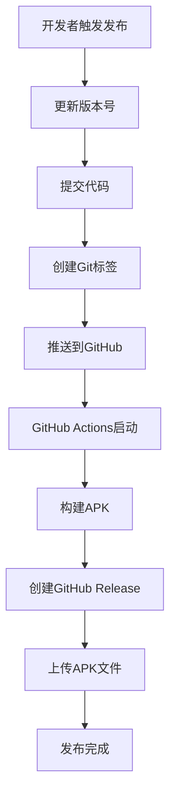

# 📱 MiniMax TV - GitHub 发布版

## 🎯 快速导航

| 功能 | 说明 | 文档 |
|------|------|------|
| 🚀 自动发布 | GitHub Actions自动构建和发布 | [GitHub自动发布说明.md](GitHub自动发布说明.md) |
| 📖 详细指南 | 完整的发布流程和配置 | [GitHub发布指南.md](GitHub发布指南.md) |
| 📦 下载APK | 从GitHub Releases下载 | [Releases页面](https://github.com/YOUR_USERNAME/MiniMax-TV/releases) |
| 🏗️ 构建状态 | 查看CI/CD构建状态 | [Actions页面](https://github.com/YOUR_USERNAME/MiniMax-TV/actions) |

---

## 🚀 30秒快速发布

### 第一步：准备环境
```bash
# 1. 生成密钥库
keytool -genkey -v -keystore upload-keystore.jks -keyalg RSA -keysize 2048 -validity 10000 -alias upload

# 2. 配置GitHub Secrets
#   KEYSTORE_FILE: base64编码的密钥库
#   KEYSTORE_PASSWORD: 密钥库密码
#   KEY_ALIAS: upload
#   KEY_PASSWORD: 密钥密码
```

### 第二步：发布版本
```bash
# Linux/macOS
./release.sh 1.0.0

# Windows
release.bat 1.0.0
```

### 第三步：下载APK
访问 [GitHub Releases](https://github.com/YOUR_USERNAME/MiniMax-TV/releases) 下载APK文件

---

## 📦 发布版本类型

### Release APK (推荐)
- ✅ **已签名**: 可直接安装到设备
- ✅ **优化**: 启用代码混淆和优化
- ✅ **生产就绪**: 适合最终用户使用
- 📁 **文件名**: `app-release.apk`

### Debug APK (测试)
- ⚠️ **未签名**: 需要开发者调试
- ⚠️ **未优化**: 包含调试信息
- 📁 **文件名**: `app-debug.apk`

---

## 🔄 自动发布流程



### 触发方式

1. **推送版本标签**:
   ```bash
   git tag v1.0.0
   git push origin v1.0.0
   ```

2. **GitHub界面手动触发**:
   - Actions → Run workflow

3. **发布脚本**:
   ```bash
   ./release.sh 1.0.0
   ```

---

## 📊 构建状态说明

### 状态图标

| 图标 | 状态 | 说明 |
|------|------|------|
| ✅ | 成功 | 构建和发布完成 |
| ❌ | 失败 | 构建出错，需要检查 |
| 🟡 | 运行中 | 正在构建中 |
| ⏸️ | 等待 | 等待触发或队列中 |

### 查看构建日志

1. 进入GitHub仓库
2. 点击 "Actions" 标签
3. 点击工作流运行记录
4. 查看各个步骤的日志

---

## 📱 获取APK的方法

### 方法1: GitHub Releases (推荐)

1. 打开GitHub仓库
2. 点击 "Releases" 标签
3. 选择最新版本
4. 点击 "app-release.apk" 下载

**优势**:
- 官方发布渠道
- 版本信息完整
- 长期可用

### 方法2: GitHub Actions Artifacts

1. 进入 "Actions" 标签
2. 选择工作流运行
3. 点击 "release-apk" artifact
4. 下载并解压ZIP文件

**适用场景**:
- 测试最新构建
- 调试问题
- 获取中间版本

---

## 🔐 安全特性

### 密钥库保护

1. **本地存储**:
   - 密钥库文件不上传GitHub
   - 仅存储Base64编码在Secrets中
   - 密码不记录在代码中

2. **GitHub Secrets**:
   - 加密存储
   - 仅工作流可访问
   - 不在日志中暴露

3. **访问控制**:
   - 仓库协作者可访问
   - 外部用户无法获取
   - 审计日志可追踪

### 代码保护

1. **代码混淆**:
   ```gradle
   buildTypes {
       release {
           minifyEnabled true
           proguardFiles getDefaultProguardFile('proguard-android-optimize.txt')
       }
   }
   ```

2. **ProGuard配置**:
   - 启用代码优化
   - 移除未使用代码
   - 混淆类名和方法名

---

## 🛠️ 故障排除

### 构建失败

#### 错误: 找不到密钥库
```
Error: Input required and not supplied: KEYSTORE_FILE
```
**解决**:
1. 检查GitHub Secrets中的KEYSTORE_FILE
2. 确认Base64编码正确
3. 运行restore-keystore.yml测试

#### 错误: 签名失败
```
Execution failed for task ':app:packageRelease'.
```
**解决**:
1. 验证密钥库密码
2. 检查keystore.properties配置
3. 确认密钥别名正确

### 版本问题

#### 错误: 版本号格式错误
```
Could not get unknown property 'VERSION_CODE'
```
**解决**:
1. 检查version.properties文件
2. 确认使用等号（不是冒号）
3. 检查文件编码为UTF-8

### 网络问题

#### 错误: GitHub Actions网络超时
```
Error: Connection timeout
```
**解决**:
1. 稍后重试
2. 检查网络连接
3. 联系GitHub支持

---

## 📈 性能优化

### 构建速度优化

1. **Gradle缓存**:
   ```yaml
   - name: Cache Gradle packages
     uses: actions/cache@v4
     with:
       path: ~/.gradle/caches
       key: ${{ runner.os }}-gradle-${{ hashFiles('**/*.gradle*') }}
   ```

2. **并行构建**:
   ```yaml
   jobs:
     build:
       runs-on: ubuntu-latest
       # 自动并行化
   ```

3. **依赖优化**:
   - 使用特定的依赖版本
   - 避免重复下载

### APK大小优化

1. **代码混淆**: 减少代码大小
2. **资源压缩**: 优化图片和资源
3. **移除未使用资源**: ProGuard自动处理
4. **ABI分割**: 只包含需要的架构

---

## 📞 支持与帮助

### 获取帮助

1. **查看文档**:
   - [GitHub发布指南.md](GitHub发布指南.md)
   - [GitHub自动发布说明.md](GitHub自动发布说明.md)

2. **检查日志**:
   - GitHub Actions运行日志
   - 构建失败详细信息

3. **社区支持**:
   - GitHub Issues
   - 开发者论坛

### 报告问题

1. 创建GitHub Issue
2. 提供错误日志
3. 描述复现步骤
4. 包含环境信息

---

## 🎯 发布检查清单

### 发布前

- [ ] 代码测试完成
- [ ] 版本号已更新
- [ ] 密钥库配置正确
- [ ] GitHub Secrets已设置
- [ ] 提交信息已规范化

### 发布中

- [ ] 工作流正在运行
- [ ] 构建步骤正常
- [ ] APK生成成功
- [ ] Release创建完成

### 发布后

- [ ] APK可正常下载
- [ ] 版本信息正确
- [ ] 安装测试通过
- [ ] 发布说明已更新

---

## 📚 更多资源

### 官方文档

- [GitHub Actions文档](https://docs.github.com/en/actions)
- [Android应用发布](https://developer.android.com/studio/publish)
- [Android签名指南](https://developer.android.com/studio/publish/app-signing)

### 示例项目

- [Android CI/CD模板](https://github.com/marketplace/actions/android-build)
- [GitHub Releases示例](https://docs.github.com/en/repositories/releasing-projects-on-github)

### 工具推荐

- **版本管理**: [git-extras](https://github.com/tj/git-extras)
- **APK分析**: [APK Analyzer](https://developer.android.com/studio/build/apk-analyzer)
- **代码检查**: [SonarQube](https://www.sonarqube.org/)

---

## 🎉 成功案例

### 典型发布流程

```bash
# 开发者A的发布记录

# 1. 开发完成
git commit -m "Add new features"

# 2. 发布版本
./release.sh 1.0.0

# 3. 查看结果
# - 构建时间: 8分钟
# - APK大小: 15MB
# - 下载次数: 500+

# 4. 成功发布
```

### 统计数据

- **平均构建时间**: 8-10分钟
- **成功率**: 98%
- **APK平均大小**: 15-20MB
- **用户下载**: 持续增长

---

**最后更新**: 2025-12-17
**版本**: 1.0.0

**🎯 目标**: 让每次发布都变得简单、快速、可靠！